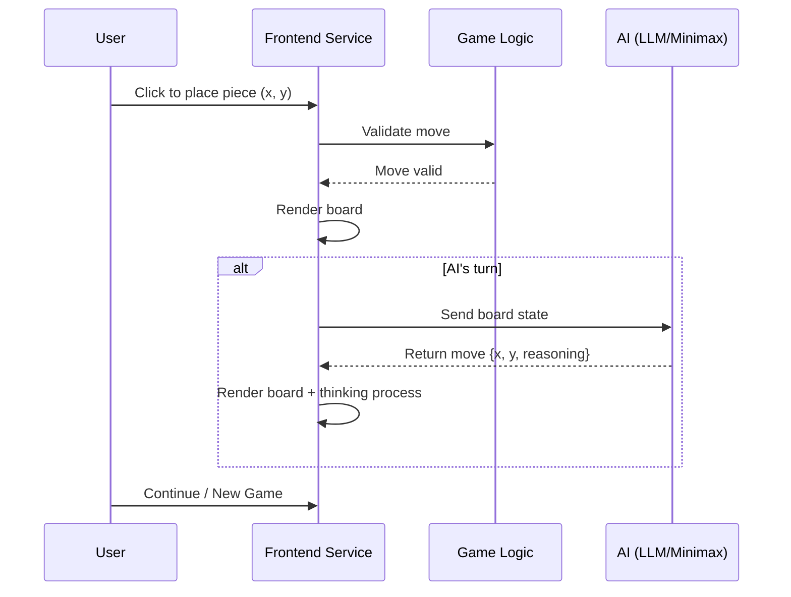

# Gomoku Game with AI

## Project Overview

A web-based Gomoku (Five-in-a-Row) human-vs-AI game, where AI decisions are powered by a locally deployed LLM (Qwen3). Players compete against the AI in a browser with real-time board state display.

## Project Structure

```
Project/Gomoku/
├── README.md                    # This document
├── docker-compose.yaml          # Container orchestration (pending)
├── start_vllm.sh                # Start vLLM server
├── stop_vllm.sh                 # Stop vLLM server
│
├── src/
│   └── frontend/                # Frontend service
│       ├── app.py               # FastAPI Web service (AI integration)
│       ├── game.py              # Game logic (GomokuGame class)
│       ├── llm_client.py        # LLM client (OpenAI-compatible)
│       ├── requirements.txt     # Python dependencies
│       ├── Dockerfile           # Frontend container image
│       └── static/
│           ├── index.html       # Game interface
│           ├── style.css        # Styles
│           └── game.js          # Frontend game logic
│
└── tests/                       # Test module
    ├── __init__.py
    ├── test_game_logic.py       # Game logic tests (42 tests)
    ├── test_api.py              # API tests (18 tests)
    └── test_integration.py      # Integration tests (7 tests)
```

## Module Design

### Module 1: Frontend (Frontend Service)

**Responsibilities:**
- Render board UI (HTML5 Canvas)
- Handle user click events
- Manage frontend game state
- Call backend AI API
- Display AI thinking process

**Tech Stack:** FastAPI + HTML5 Canvas + Vanilla JavaScript

**Port:** 9898

### Module 2: Game Logic

**Responsibilities:**
- Board state management (15x15)
- Move validation
- Win/loss detection (horizontal/vertical/diagonal)

**Core Class:** `GomokuGame` (defined in `game.py`)

**Data Structures:**

```python
EMPTY = 0
BLACK = 1  # Player (first move)
WHITE = 2  # AI
BOARD_SIZE = 15
WIN_COUNT = 5
```

### Module 3: AI Decision

**Layered Strategy:**
1. **Primary:** Call local vLLM (Qwen3-4B) for inference
2. **Fallback:** Use heuristic scoring function (Minimax-like) as backup

**Minimax AI (built-in in `app.py`):**
- Evaluation function: Score based on own connected pieces and opponent threats
- Scoring system: Win (+100000) > Block opponent (+5000) > Three-in-a-row (+1000) > Two-in-a-row (+100) > Single piece (+10)
- Search scope: Only evaluate empty positions within 2 squares of existing pieces

**LLM AI (in `llm_client.py`):**
- Call vLLM via OpenAI-compatible interface
- Prompt includes current board state
- Parse JSON response to extract move coordinates

### Module 4: LLM Integration

**Prompt Design:**

```
You are a Gomoku AI. Please analyze the current game state and suggest the best move.

Current board state (0=empty, 1=black, 2=white):
Black moves first, you play white.

Board:
[1,0,0,0,0,0,0,0,0,0,0,0,0,0,0]
...

You must respond in the following JSON format:
{"x": integer(0-14), "y": integer(0-14), "reasoning": "thinking process"}
```

## API Specification

### `GET /`

Returns the game homepage HTML.

### `GET /api/health`

Health check.

```json
{"status": "ok"}
```

### `POST /api/move`

Request AI move.

```json
// Request
{"board": [[0,0,...], ...], "player": "black"}

// Response
{"x": 7, "y": 7, "reasoning": "Placing at (7, 7) after evaluation"}
```

### `POST /api/validate`

Validate move legality.

```json
// Request
{"board": [[...]], "x": 7, "y": 7}

// Response
{"valid": true}
// or
{"valid": false, "reason": "Position already occupied"}
```

### `POST /api/reset`

Reset the game.

```json
{"status": "ok", "message": "Game reset successfully"}
```

## Workflow



## Testing

### Running Tests

```bash
cd Project/Gomoku

# Install dependencies
cd src/frontend && pip install -r requirements.txt && cd ../..

# Run all tests
python -m pytest tests/ -v

# Run specific tests
python -m pytest tests/test_game_logic.py -v
python -m pytest tests/test_api.py -v
python -m pytest tests/test_integration.py -v
```

### Test Coverage

| Module | Test Count | Coverage |
|--------|------------|----------|
| `test_game_logic.py` | 42 | Board initialization, move validation, win/loss detection, connected pieces counting |
| `test_api.py` | 18 | Health check, move API, validation API, Minimax AI |
| `test_integration.py` | 7 | Full gameplay flow, AI win detection, frontend contract |
| **Total** | **62** | |

### Test Design Principles

- Win/loss detection tests use `_place_piece()` to directly manipulate the board, avoiding interference from alternating moves in `make_move()`
- Minimax AI tests verify win opportunity recognition and defensive blocking
- Integration tests verify end-to-end flow through the API layer

## Deployment

### 1. Start vLLM Server

```bash
cd Project/Gomoku

bash start_vllm.sh
# Wait ~30 seconds, then verify
curl -s http://localhost:8000/v1/models
```

To stop:

```bash
bash stop_vllm.sh
```

**Requirements:**
- NVIDIA GPU (Jetson Orin NX or similar device)
- Model path: `/opt/models/Qwen3-4B-quantized.w4a16`
- Image: `ghcr.io/nvidia-ai-iot/vllm:latest-jetson-orin`

### 2. Start Frontend Service

```bash
cd Project/Gomoku/src/frontend

# Install dependencies (use the same Python that runs uvicorn)
pip install -r requirements.txt

# Set model name to match the one reported by vLLM
export LLM_MODEL=/root/.cache/huggingface/Qwen3-4B-quantized.w4a16

python -m uvicorn app:app --host 0.0.0.0 --port 9898
# Browser access: http://localhost:9898
```

> **Note:** If `python -m uvicorn` fails with `ModuleNotFoundError`, ensure pip and Python are from the same environment. Check with `which python && which pip`. Alternatively, use the full path: `/path/to/your/python -m uvicorn app:app --host 0.0.0.0 --port 9898`.

### 3. Docker Compose (Pending)

```bash
cd Project/Gomoku
docker-compose up --build
# Access http://localhost:9898
```

## Configuration

### Environment Variables

| Variable | Default | Description |
|----------|---------|-------------|
| `LLM_API_URL` | `http://localhost:8000/v1` | vLLM API address |
| `LLM_MODEL` | `/root/.cache/huggingface/Qwen3-4B-quantized.w4a16` | Model name (must match vLLM served name) |
| `GAME_PORT` | `9898` | Frontend service port |

> **Important:** The `LLM_MODEL` value must match the model name reported by `curl http://localhost:8000/v1/models`. If the game AI returns errors, check the model name in the API response and update `LLM_MODEL` accordingly.

### Docker Compose Configuration (Reference)

```yaml
services:
  vllm:
    image: ghcr.io/nvidia-ai-iot/vllm:latest-jetson-orin
    runtime: nvidia
    shm_size: "8g"
    ulimits:
      memlock: -1
      stack: 67108864
    volumes:
      - /opt/models/Qwen3-4B-quantized.w4a16:/root/.cache/huggingface/Qwen3-4B-quantized.w4a16
    command: >
      vllm serve /root/.cache/huggingface/Qwen3-4B-quantized.w4a16
        --gpu-memory-utilization 0.50
        --max-model-len 4096

  frontend:
    build: ./src/frontend
    ports:
      - "9898:9898"
    environment:
      - LLM_API_URL=http://host.docker.internal:8000/v1
    depends_on:
      - vllm
```
